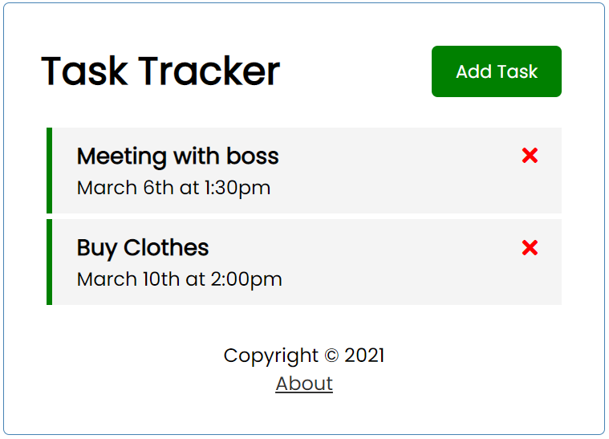

# Task Manager

## Tutorial Traversy Media
https://www.youtube.com/watch?v=qZXt1Aom3Cs&t=2125s

## Para rodar localmente:
- Instale as dependências: npm install
- Instale o Json Server: npm install -g json-server
- Rodar dados do json server: npm run json-server
- Rodar projeto: npm run serve

